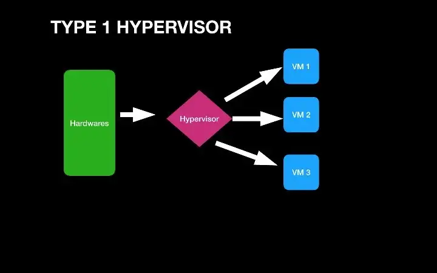
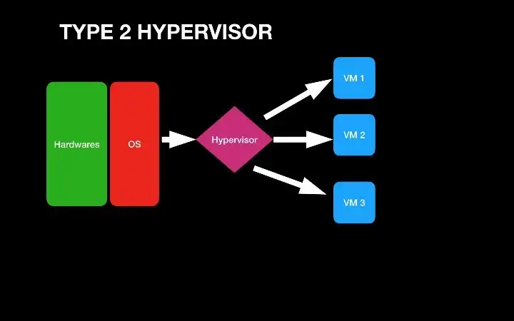

# Week 1

## Learning Outcomes and Topics
This week:
- Introductions
- Course Outline
- What is Linux
- Set up a Linux VM
	- Overview of some of the tools that we will be using this term

Next week:
- Review of several commands used to navigate and find things in the command line
	- ls
	- cd
	- pwd
	- grep
	- find
- Getting help in the command line
	- using manules with the `man` utility
	- using `help` for bash builtins

## Introductions

**About me**
- I started using a Linux distribution in the late 90s, [Slackware](http://www.slackware.com/)  
- Most of my professional work has involved a Linux operating system.  
	- I have primarily worked in System Administration and DevOps fields.  
- In my free time I like to try out new Linux distros and other open source software.  
- Over the years I have contributed to a number of open source projects.  
- I also enjoy some of the usual nerdy things:  
	- Sci-Fi  
	- Comics  
- When I am not doing something related to the above I am probably climbing  

**About You**
- Do you have a favorite programming language or tool or technology related to the program?  
	- If so what is it and why?  
- Do you have any previous experience using a Linux OS or a BSD OS? (other than 1420)  
- On a scale of 1 - 10 how comfortable are you working in the command line?  
- Outside of your school work what do you like to do? What is a primary hobby of yours?   

## Course Outline

**Evaluation Criteria**

| Criteria | % | Comments |
|----------|---|----------|
| Quizzes | 10 | |
| Labs | 20 | |
| Assignments | 20 | 2x 10% each |
| Midterm Exam | 25 | |
| Final Exam | 25 | |

**Office Hours**

Tuesday   11:30-12:30  
Thursday  09:00-10:00  
Friday    09:00-10:00  
==Please schedule at least 24 hours in advance via email or discord==

**Course Notes**

Course notes are distributed as plain text Markdown files.

The intention is that you will clone the repo and every week do a `git pull` to get the current week's notes. Once you have the notes, open them up and add your own notes to them as you work through the material.

If you are unfamiliar with Markdown, it is a simple markup language (think simplified HTML).  
You can write Markdown in any plain text editor (vim, vscode...) or one of the many note-taking apps that use Markdown. A lot of apps that you are already using probably use Markdown. For example, Notion and discord both use Markdown. 

Markdown is also used for a lot of technical documentation, most of the README files you have seen on GitHub are written in Markdown. 

[Markdown syntax cheat sheet](https://www.markdownguide.org/cheat-sheet/)

**Late Submissions**

Late submissions will be accepted up until 4 days.  
10% will be deducted per day.  
The first day begins the moment you are late. ie if an assignment is due at 23:30 and you submit at 23:31 you are a day late.

The entire course outline is available [here](https://www.bcit.ca/outlines/20231089212/)

## Some of the tools that we will be using this term

### VirtualBox 
[VirtualBox](https://www.virtualbox.org/) is a relatively easy to use virtual machine manager that is available for Linux, MacOS and Windows.

### Vagrant
[Vagrant](https://www.vagrantup.com/) Is a tool that can be used to create VM configuration in plain text files.
This means that you save your setup for a VM in a text file on GitLab for example and you can quickly recreate a new VM using this file.

### Ubuntu
[Ubuntu](https://ubuntu.com/) is a popular Linux distro used on servers, and desktops.  
Ubuntu comes in two official versions:  
- LTS 22.04  
- 22.10  

Generally, you would use the LTS(long term support) version for production work. Since we aren't going to be creating anything for production, we are going to use the slightly newer 22.10 version.

### Windows Terminal
[Windows Terminal](https://github.com/microsoft/terminal) is already installed if you are using Windows 11. In Windows 10, you can install it from the Microsoft store.
[A video intro to Windows Terminal](https://www.youtube.com/watch?v=2dsnwlnNBzs)

This is obviously only for people using Windows. If you are using BSD, Linux or MacOS you probably already have a decent terminal emulator.

### WSL
[WSL](https://learn.microsoft.com/en-us/windows/wsl/about) Windows Subsystem for Linux is a tool that you can use to run a Linux environment from within Windows. This is a popular tool for developers who use Windows because it gives them easy access to a Linux development environment.

### DigitalOcean
[DigitalOcean](https://www.digitalocean.com/) DigitalOcean is a cloud service provider. We will be using this near the end of the term, so we will come back to it then.

## Before we get started, some useful terminology

**open source**

open source software is software that provides the source code which can be freely used, shared and modified.

Do You think open source software is less secure than closed source software?  
What is your reason for thinking that?

About 90% of most applications are built on open source code.
[Video on 2022 open source stats](https://www.youtube.com/watch?v=g0LYPJitubc)

[open source](https://opensource.org/licenses)

**Free software**

Although Free and open source are not the same thing, they are often related, and are very much related in the context of Linux based operating systems.

> Thus, “free software” is a matter of liberty, not price. To understand the concept, you should think of “free” as in “free speech,” not as in “free beer”.
> [GNU philosophy](https://www.gnu.org/philosophy/free-sw.html)

**System administration, SRE(site reliability engineer) and DevOps**

In as broad a definition as is possible, a system administrator is someone who configures and keeps computer systems running.

A site reliability engineer is someone who works in operations and solves operations problems as if they were software problems.

> DevOps is a modern way to deliver higher quality applications faster - by automating the software delivery lifecycle, and by giving development and operations teams more shared responsibility and more input into each other’s work.

> Like SRE, DevOps makes a business more agile by balancing the need to deliver more applications and changes faster with the need to avoid 'breaking' the production environment. And like SRE, DevOps aims to achieve this balance by establishing an acceptable risk of errors. In fact, SRE and DevOps seem so similar that some experts say they're the same thing - but most see SRE practices as excellent ways to implement DevOps principles. 
> [IBM](https://www.ibm.com/cloud/learn/site-reliability-engineering)

## Virtualization review

> Software called [hypervisors](https://www.redhat.com/en/topics/virtualization/what-is-a-hypervisor) separate the physical resources from the virtual environments—the things that need those resources. Hypervisors can sit on top of an operating system (like on a laptop) or be installed directly onto hardware (like a server), which is how most enterprises virtualize. Hypervisors take your physical resources and divide them up so that virtual environments can use them.  
> Red Hat, What is virtualization

- Is VirtualBox an example of a type 1 or type 2 hypervisor?
- What are some reasons that an individual or organization might use a VM?

[Red Hat, What is virtualization](https://www.redhat.com/en/topics/virtualization/what-is-virtualization)

[Short Video on Virtualization](https://www.youtube.com/watch?v=FZR0rG3HKIk)

## What is Linux

- What is Linux?
- What is a Linux distro?
- Who is using Linux and what are they using it for?
	- Why are these people using Linux?
- Who created Linux?
	- Who is maintaining it now?

**The Linux Kernel**

The kernel has 4 jobs:

1.  **Memory management:** Keep track of how much memory is used to store what, and where
2.  **Process management:** Determine which processes can use the central processing unit (CPU), when, and for how long
3.  **Device drivers:** Act as mediator/interpreter between the hardware and processes
4.  **System calls and security:** Receive requests for service from the processes

**Distros that I use regularly**

[Fedora Silverblue](https://silverblue.fedoraproject.org/)

[openSuse MicroOS](https://microos.opensuse.org/) (I am using this right now)

[Alpine Linux](https://www.alpinelinux.org/)

[OpenBSD](https://www.openbsd.org/) (not Linux, but closer to Linux than MacOS or Windows)

[Red Hat What is the Linux kernel](https://www.redhat.com/en/topics/linux/what-is-the-linux-kernel)  
[IBM, The Linux kernel](https://developer.ibm.com/articles/l-linux-kernel/)

## Reading

Readings should be completed before the start of next weeks class.

Most of the readings will be available on O'Reilly learning. You have access to this through BCIT. In the past, students have used this before in other classes and know how to access readings here. If this is not the case, let me know and I will add instructions here.

This week's readings come from *A Practical Guide to Linux Commands, Editors, and Shell Programming*, Fourth Edition, by Mark Sobell and Matthew Helmke

Chapter 2, *Getting Started*
- [Working from the Command Line](https://learning.oreilly.com/library/view/a-practical-guide/9780134774626/ch02.xhtml#ch02lev1sec4)  
- [`man`: Displays the System Manual](https://learning.oreilly.com/library/view/a-practical-guide/9780134774626/ch02.xhtml#ch02lev2sec5)  

Chapter 3, *The Utilities*
- [Basic Utilities](https://learning.oreilly.com/library/view/a-practical-guide/9780134774626/ch03.xhtml#ch03lev1sec3)  
- [`less` Is `more`: Display a Text File One Screen at a Time](https://learning.oreilly.com/library/view/a-practical-guide/9780134774626/ch03.xhtml#ch03lev1sec4)  
- [Working with Files](https://learning.oreilly.com/library/view/a-practical-guide/9780134774626/ch03.xhtml#ch03lev2sec6)  
