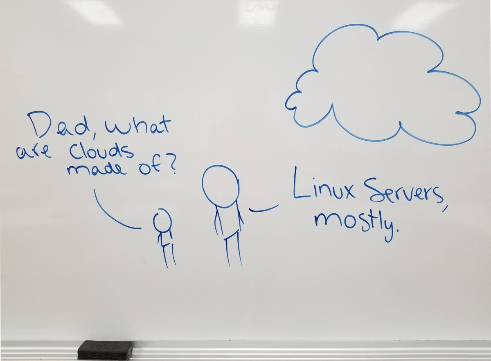

## Learning Outcomes and Topics

This week:

- Disable ssh connection to the root user

- Install nginx with apt

- Configure nginx to serve a simple static site

Next week:

- VPC

- Load Balancer

- Reverse Proxy Server





## Web Servers

When we talk about a web server, we might be talking about hardware, the physical server, or software. Today we are going to focus on the software.


In the simplest case a web server is software that listens for an HTTP(S) request and responds by sending a file via an HTTP(S) response.


The web server that we are going to look at today does a little more than this.

**Ports:**

- HTTP 80 

- HTTPS 443 

- SSH 22

Reference:

[What is a web server? - Learn web development | MDN](https://developer.mozilla.org/en-US/docs/learn/common_questions/what_is_a_web_server)

## nginx

> nginx [engine x] is an HTTP and reverse proxy server, a mail proxy server, and a generic TCP/UDP proxy server.


nginx was originally created by Igor Sysoev, and first released in 2004.


nginx is widely used in industry by large companies including Dropbox and Netflix.


Reference:

[nginx](https://nginx.org/en/)

[NGINX | High Performance Load Balancer, Web Server, & Reverse Proxy](https://www.nginx.com/)


### nginx Configuration files

nginx configuration files live in `/etc/nginx`

default content served by nginx lives in `/var/www/html`


In addition to `sudo systemctl status nginx` and `sudo journalctl -u nginx` You can view logs for nginx in `/var/log/nginx`

### server blocks

nginx can serve multiple sites on a single host machine.

To do this you can create a new server block in `/etc/nginx/sites-available` and create a soft-link to this in sites-enabled.

example server block, without domain name

Generally the ip address in the example config below would be the domain name of your site. 


```text
server {
        listen 80;
        listen [::]:80;

        root /var/www/path-to-your-html-documents;
        index index.html;

        server_name 137.184.173.46;

        location / {
                try_files $uri $uri/ =404;
        }
}
```


Notice that the examples root points to /var/www/ip-address/html

example index.html file

```html
<!DOCTYPE html>
<html lang="en">
<html>
    <head>
		<meta charset="UTF-8" />
        <title>Example Site for 2420</title>
    </head>
    <body>
        <h1>Success!</h1>
        <h2 style="color: red;">My server is up and running!</h2>
    </body>
</html>
```

you will need to create this 👆 index.html page in the html directory where the static content you are serving exists.

when you have the following:

- content to serve in root

- a server block in /etc/nginx/sites-available/


test your nginx configuration

`sudo nginx -t`


you can create a soft link to your new server block in sites-enabled

`sudo ln -s /etc/nginx/sites-available/your-config-file /etc/nginx/sites-enabled/`


and finally restart the nginx service

`sudo systemctl reload nginx`

if everything worked go to your ip address in the browser and you should see

the rendered HTML document


Some of the above is slightly different on RedHat family distros. CentOS, Rocky, RHEL…


## Firewalls

We are going to look at two different tools that can be used to create a firewall. In practice you will most likely be using a cloud solution, the second option. However it helps to understand how to setup a Firewall in a Linux environment, because this is what a cloud services firewall is. A Linux VM, that can be configured through the cloud service providers API.

## UFW The Uncomplicated FireWall

The uncomplicated firewall is the default firewall configuration tool for Ubuntu (you can install it on other distributions) ufw was created to make working with iptables easier.


Reference:

[UFW](https://help.ubuntu.com/community/UFW)

[Uncomplicated Firewall](https://wiki.archlinux.org/title/Uncomplicated_Firewall)


Configuration files

The main configuration files live in `/etc/ufw` rules with 6 in the file name, ie user6.rules are for ipv6

ufw status

```text
sudo ufw status
```

ufw app list

```text
sudo ufw app list
```

ufw allow

```text
sudo ufw allow OpenSSH
sudo ufw allow 'Nginx HTTP'
```

ufw allow from

```text
sudo ufw allow from 203.0.113.4 to any port 22
```

turn your firewall on and off

You can enable your firewall, with you guessed it

```text
sudo ufw enable
```

if you need temporarily turn your firewall off for some reason

```text
sudo ufw disable
```

ufw deny

Just like you can create rules to allow certain applications to connect to your server you can create rules to deny access

deny a specific ip address

```text
sudo ufw deny from 143.110.213.138
```

ufw delete a rule

You can delete a ufw rule by number

```text
sudo ufw status numbered
```

```text
Status: active

     To                         Action      From
     --                         ------      ----
[ 1] 22                         ALLOW IN    15.15.15.0/24
[ 2] 80                         ALLOW IN    Anywhere
```

```text
sudo ufw delete 2
```

then check the status again.

## Cloud Firewalls

Cloud firewalls work on the same principals as UFW. We create a series of rules that determine the type of traffic we want to allow in and out of a server.

Setting up a cloud firewall in DigitalOcean is really easy.

Generally we define a relationship using Tags. You can for example create 2(or more) droplets with the tag “Web” and use a single firewall for all of the droplets with the tag “Web”


.png)


[Cloud Firewalls | DigitalOcean Documentation](https://docs.digitalocean.com/products/networking/firewalls/)


## Disable ssh via root


It is considered a good security measure to disable the ability to connect to a server over SSH as the root user. 


Why do you think that is?


So We are going to make the necessary changes to our DO droplets so that only a regular user can connect to the server via SSH.


**Make sure you can connect to your server via ssh as a regular user before doing this!**


SSH configuration exists in the `/etc/ssh` directory. 

Specifically we are looking for the `/etc/ssh/sshd_config` file.


`sudo vim /etc/ssh/sshd_config` to open the file in vim.


next search for the line "PermitRootLogin yes" Change the yes, to a no and save the file.


After editing the files reload the ssh service `sudo systemctl reload ssh`


Now exit from your ssh connection and try to connect via ssh as root. If all went well you should see a permission denied error.


## Reading

[What is a reverse proxy? | Proxy servers explained](https://www.cloudflare.com/learning/cdn/glossary/reverse-proxy/)

[What is load balancing? | How load balancers work](https://www.cloudflare.com/learning/performance/what-is-load-balancing/)

[What is a virtual private cloud (VPC)?](https://www.cloudflare.com/learning/cloud/what-is-a-virtual-private-cloud/)


## Assignment 2 Part 1


You need to be able to create a regular user on a DigitalOcean droplet that you can access via ssh, using ssh keys. You should do this from your WSL Linux environment if you are working from a Windows machine. If you haven't created and added ssh keys to DigitalOcean yet, do so before doing the assignment.


Due Date: Friday March 31 23:30


### Instructions


Take screenshots and include a short note that describes each of the steps below.


**Step one** create a new Ubuntu 22.10 or 22.04 server on DigitalOcean. When you are creating this server add a tag "web"


**Step two** create a new regular user on the server, grant your new user sudo privileges and confirm that you can connect to your server via SSH.


**Step three** disable the ability to connect to the server via SSH as the root user


**Step four** on your host machine, in WSL, create a new "web" directory in your home directory '~/'


**Step five** write an nginx configuration file(2420.conf) and a simple HTML document(index.html) inside the new web directory on your host machine.


**Step six** copy the web directory to your server via sftp


**Step seven** move the 2420.conf file into `/etc/nginx/sites-available`After doing this, move the web directory from your users home directory to` /var/www`


**Step eight** test your nginx config


**Step nine** enable your nginx config


**Step ten** disable the default nginx config file


**Step eleven** reload the nginx service


**Step twelve** setup a firewall that will allow you to connect to your server via ssh and http. You can use UFW or a digitalOcean firewall for this.

## Grading


1 point per each of the 12 steps listed

5 points for the clarity of your accompanying notes. These notes should indicate your understanding of each process.

### Submission Instructions


Submit a single .pdf your-name-as2-1.pdf using the dropbox on D2L.

Your pdf should include your HTML document and nginx configuration file in addition to the screenshots and notes described above.

