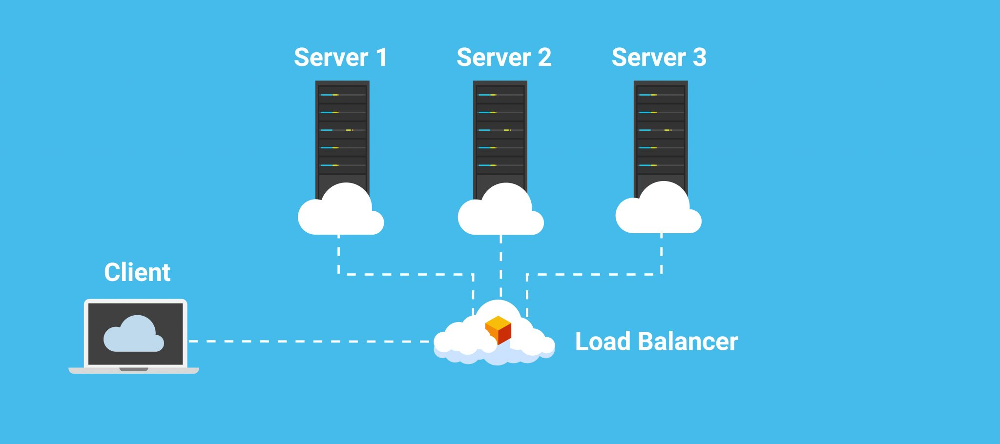

## Learning outcomes and topics

This week:

- Cloud networking:

    - Create a VPC on DigitalOcean

    - Create a load balancer in the a VPC in DigitalOcean

- Update your nginx configuration to include a reverse proxy server

- Add an example backend to your web server

Next week:

- Final Exam


## VPC


> A VPC is a public cloud offering that lets an enterprise establish its own private cloud-like computing environment on shared [public cloud](https://www.ibm.com/cloud) infrastructure. A VPC gives an enterprise the ability to define and control a virtual network that is logically isolated from all other public cloud tenants, creating a private, secure place on the public cloud.
​ [ibm](https://www.ibm.com/topics/vpc)


In other words a VPC allows for the creation of an isolated private network, within the public cloud. This can be used to create a space where different infrastructure components can communicate with each other, but aren't directly exposed to the public internet. For example you could create an application made up of a couple VM's, several databases, a load balancer and other components and perhaps only the load balancer is publicly accessible. 


VPCs offer a few advantages, security is an obvious one, another is scalability.


VPCs work using a subnet. A subnet (sub-network) is a network inside of a network. 

A private range of IP address or a CIDR (Classless Inter-Domain Routing). For example The CIDR 10.0.0.0/16 can contain 65,536 IP addresses from 10.0.0.1 to 10.0.255.254.


This same private network range can be used multiple times, without conflict. So a single organization could have many VPCs with the CIDR 10.0.0.0/16. Each of which could have 65,536 components with their own IP address inside of that VPC.


### DigitalOcean VPCs


We have actually already been using a VPC. Most cloud service providers offer a "default" VPC for small experiments. We have been using the default VPC in the sfo3 region.


You can create a new VPC in the "Networking" section, which is under "Manage" in the side menu from the web console.


After you have created a new VPC you will have a new dropdown menu VPC option when you create other resources, so that you can add droplets, databases and other infrastructure to your new VPC network.


References:

[VPC | DigitalOcean Documentation](https://docs.digitalocean.com/products/networking/vpc/)

[CIDR.xyz](https://cidr.xyz/)

## Load Balancer


> Load balancing is the practice of distributing computational workloads between two or more computers. On the Internet, load balancing is often employed to divide network traffic among several servers. This reduces the strain on each server and makes the servers more efficient, speeding up [performance](https://www.cloudflare.com/learning/performance/why-site-speed-matters/) and reducing [latency](https://www.cloudflare.com/learning/performance/glossary/what-is-latency/). Load balancing is essential for most Internet applications to function properly.
[​cloudflare](https://www.cloudflare.com/learning/performance/what-is-load-balancing/)





A load balancer acts as a single point of contact for multiple servers. Distributing traffic to all of the servers it sits in front of. 


Load balancers provide performance and scalability.


Static VS Dynamic load balancer.

A static load balancer has a fixed algorithm used to select which server it will route traffic to. For example: If you have three servers the load balancer might always select, 1-2-3-1-2-3... 


A dynamic load balancer can perform health checks, to test if a server is up and running and will direct traffic to healthy servers only.


A load balancer can also be used as part of a deployment strategy. Suppose we have two versions of an application V1.2.1 and V1.2.2. The newer version represents a small change in the application. Some of our servers might run the newer version, while others run the older version. Gradually we would replace the older version with the newer version on all of the servers.


### DigitalOcean Load Balancers


DigitalOcean load balancers have pretty good defaults. You really just need to add one to the same VPC where your servers will be and select the servers you want to load balance. I find the easiest way to do this is with a tag, similar to adding a firewall. The defaults will be more than sufficient for our needs for the assignment.


References:

[Load Balancers | DigitalOcean Documentation](https://docs.digitalocean.com/products/networking/load-balancers/)

## Reverse proxy server


> A **reverse proxy server** is a type of proxy server that typically sits behind the firewall in a private network and directs client requests to the appropriate backend server. A reverse proxy provides an additional level of abstraction and control to ensure the smooth flow of network traffic between clients and servers.
[​nginx](https://www.nginx.com/resources/glossary/reverse-proxy-server/)

### Add a reverse proxy using nginx

The bare minimum needed to create a reverse proxy server with nginx is just two lines of code (three if you count the closing curly bracket):

1. The location, this is appended to your URL path.

2. The host and port that your server is running on

This goes in your server block we configured last week.

```text
location /app {
	proxy_pass http://127.0.0.1:8080;
}
```


References:

[Module ngx_http_proxy_module](https://nginx.org/en/docs/http/ngx_http_proxy_module.html#proxy_pass)

### Example `curl` commands to test your server


send a get request

```shell
curl http://your-IP-address/path/to/resource
```


Send a post request with some JSON data.

```shell
curl -X POST -H "Content-Type: application/json" \
    -d '{"message": "echo from your server" }' \
    http://your-IP-address/path/to/resource
```

## Exam Breakdown


35% Quiz/short answer questions, closed book.

65% Practical, open book.


The final exam is comprehensive. Study everything from week 1 through week 11.


Quiz and short answer questions will be based on the readings.


These are just suggestions, to help you study.

Prepare a document(s) for yourself that includes, examples of configuration and commands. Creating this will help you study the material, and might highlight any gaps in your knowledge. I would also include some external resources, links to relevant documentation. This way if you need to explain  something, you have a resource at your finger tips.


As you go through the reading prepare "flash cards". Share flash cards with other people in the class and go through each others questions. Creating questions based on the readings will help isolate practical knowledge from the readings.

### What to have ready and with you in the exam

- A pen or pencil and some paper (really!)
- Two new DigitalOcean droplets, with a regular user that you can connect to via ssh. You only need one, the other is a back-up, plan B. 
- A VM on your host, this is plan C.
- Water
- Your student ID


#### Good luck everyone

## Assignment 2-2


Read all of the instructions first, don't forget to read the submission instructions.


**Due Date:** Friday April 07 23:30


### Instructions


Start by cloning the GitLab repo below to your host machine. Clone the repo to a directory in your WSL file path. This repository contains several configuration files that you will need to complete as well as an example backend application binary and an example HTML document.

The application has the following endpoints:

- GET /hey This returns a plain text response

- POST /echo This will "echo" back any data you send in a POST request

The application is serving content on localhost:8080


[cit_2420 / 2420-2023-as2-start · GitLab](https://gitlab.com/cit2420/2420-2023-as2-start)


For each of the steps below include screenshots that document that step, and notes on what is being done. What do the files do? what do commands do? where should files be on your system? why should those files be in those locations... Include all of this in a single PDF.


**step 1:** Create a new DigitalOcean VPC in the SFO3 region. 

- Give your VPC the name "2420-as2-vpc"

- Configure your own IP range, 10.0.0.0/24


**step 2:** Create two new servers (droplets). Your servers should have the host names: 'webserver-1' and 'webserver-2' each server should have the tag 'web'. These servers should be in the VPC you created in step one.


**step 3:** Create a new regular user, 'weby' on each of your servers.  Use a script to create your new user. Run your script from your host, WSL environment.
​The new user should have a home directory in /home and use the bash shell as their login shell. They should also probably be a member of the sudo group.

You should be able to connect to your new user via ssh.

Your script should also update your package repositories, and install nginx.

There is a short video on D2L -> Content -> DigitalOcean that will help you write this script.


**step 4:** Edit the nginx configuration in the starter code. Look at your nginx configuration file from last week. Your server should include 3 locations. 

- 1 for your HTML document which will be in /var/www/web again

- 2 for the "backend" server, described above


**step 5:** Edit the service file included in the starter files. This service will start your "backend" server. The backend server will be in `/var/www/app`. The service file includes all of the necessary directives, you just have to add the values. See the man pages to learn more about the directives.


**step 6:** Transfer all of the necessary components to your servers. nginx configuration, service file, html document and server binary. You may have to create some directories. You can do all of this with rsync or sftp from your host machine. You could combine this with step 7, part of 8 and part of 9.


**step 7:** Move your web content to the specified locations on your server

- /var/www/web/index.html

- /var/www/app/server


**step 8:** Move your nginx config file to the appropriate location, enable, and test your nginx configuration. 


**step 9:** Move your service file to the appropriate location, start and enable the service file


**step 10:** Test that both of your servers are working using curl. You should be able to run curl commands against all three endpoints on both of your servers.
​Run your curl commands from your host machine, WSL.


**step 11:** Add a cloud firewall to your servers that will: 

- Allow HTTP traffic from within your VPC only

- Allow SSH from anywhere

- Leave the Outbound rules in the default configuration.

- ​Name Your firewall "2420-as2-webfw"

- Use the web tag to specify which resources your firewall sits in front of.


**step 12:** Add a load balancer to your VPC that will: 

- Load balance your servers using the tag web

- You should be able to view your pages content by visiting the Load balancer's IP address, but not by visiting the IP address of either of your individual servers.

- Name you load balancer "2420-as2-lb"


**step 13:** Test your server with `curl`.  Included screenshots with your `curl` commands and the output of each command.
​Test the following URLs

- http://your-ip-address

- http://your-ip-address/hey

- http://your-ip-address/echo

Curl commands should be run from your host machine, WSL.

### Grading


1 point per step

5 points, document that describes the steps(the what why and how)


### Submission instructions


Submit a single .pdf "your-name-as2-2.pdf" using the D2L Dropbox.

Your PDF document should include all of your configuration files used to configure your servers various components and all scripts used to setup your servers. Include these as text copied into your document. Make them code blocks, and identify the file name and location on your servers. For example:

`/etc/some/file`

```shell
Some Configuration file
```


### Things you can do afterward to keep learning: These are optional things you can try during the summer

- Add a domain name

- Add an internet gateway and or bastion server. Make this the public entry point to your other servers.

- Setup and maintain an application that you use for yourself on a server. Something like a cloud backup. You could use DigitalOcean for this, your own physical server, maybe something like a raspberry pi...

- Try installing and running a Linux server or desktop on real hardware. If you use an old laptop be realistic about performance and your expectations, it is still an old laptop.


