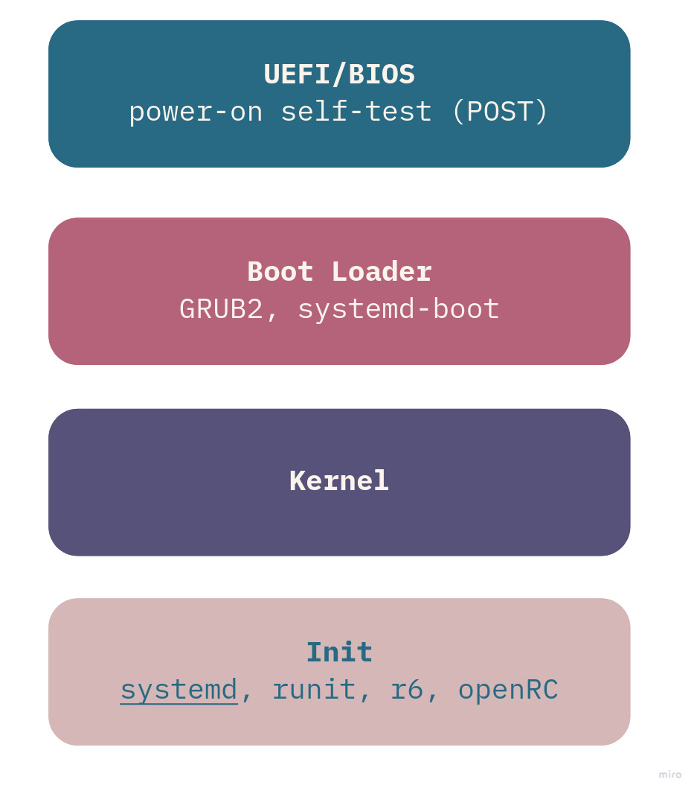
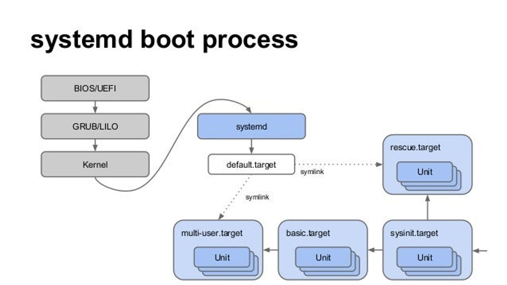

## Learning outcomes and topics

**This week:**
-   explain the Linux boot process at a high level
-   create an account with digitalocean
-   create a droplet with digitalocean
-   use systemctl to manage services

**Next Week**
-   systemd Unit files, services and timers
-   Write a unit file that starts a script
-   Write a timer that starts a unit at specific times

## The Linux Boot Process



the below is specific to arch, but most of it applies to most Linux distributions

[Arch boot process](https://wiki.archlinux.org/title/Arch_boot_process)

## PID 1

When you start up your computer, the first thing to startup is your BIOS (Basic I/O System). This has nothing to do with Linux and is usually stored on a separate piece of hardware in your system.

The BIOS looks for a boot-loader (systemd does actually contain a boot-loader, used by some distros). One of the most popular boot-loaders in the linux ecosystem is Grub2 (GRand Unified Bootloader). This is the boot-loader that Fedora and Ubuntu use by default. The Grub screen is the first screen that you see when you startup a VM. On your laptop or desktop, the first screen is likely some corporate branding displayed by the machine manufacturer. The boot-loader boots the linux kernel which starts systemd (or the init system your distro uses)

systemd is therefor PID 1, the first process started by Linux. systemd starts and manages all of your other processes.



PID 1 is often described as "the mother of all processes", because it starts, and in the case of systemd provides some management of other processes.

PID 1 will be your init system, even if you are not using systemd.

To see this for yourself you can run the command to the right →

```bash
ps -p 1
```

An interesting article on systemd

[Rethinking PID 1](http://0pointer.net/blog/projects/systemd.html)

## A partial list of systemd components

-   `systemd`, which is the system and service manager
-   `systemctl`, a command line tool to interact with `systemd`
-   `journald`, a unified logging framework
-   `logind`, a daemon that handles user logins and seats
-   `resolved`, `timesyncd`, and `networkd`, which are responsible for network connection, domain name resolution and synchronizing time with internet  resources

## systemd

created by Lennart Poettering and Kay Sievers in 2010

systemd includes a suite of tools for system management, not just an init system, this includes:

-   event logging journald
-   user login management logind
-   device management udevd
-   configuring network interfaces networkd

[systemd](https://systemd.io/)

In addition to currently being the most popular init system in the Linux ecosystem, systemd is also one of the most controversial software applications ever. Lennart Poettering received death threats when systemd started to be adopted by distributions.

Today systemd is the default init system on Arch Linux, Debian, Fedora, OpenSuse, Ubuntu and many other distros.

## DigitalOcean and Cloud Service Providers

A cloud service provider is generally a suite of managed tools, services, such as servers, managed databases, block storage… This is a popular alternative to managing your own physical servers, because you don’t have to maintain hardware. Although many organizations use a mixture of in house servers and cloud service providers.

DigitalOcean was created in 2011. One of their primary goals is to create a “developer focused” set of tools that make it easier to get a project up and running.

This term we will primarily be using DigitalOcean “droplets”, virtual private servers, or virtual machines running on a remote server.

[DigitalOcean | The Cloud for Builders](https://www.digitalocean.com/)

**Other cloud service providers:**
- [Cloud Computing Services | Google Cloud](https://cloud.google.com/)
- [Cloud Computing & Linux Servers | Alternative to AWS | Linode](https://www.linode.com/)
- [Cloud Computing Services - Amazon Web Services (AWS)](https://aws.amazon.com/)

## Services

The terms service, daemon and unit are often used interchangeably.

services are background processes which the user generally does not interact with.

units are particular to systemd and are configured with unit files, which we will look at next class.

> Processes are one or more running instances of a program. Every task in a Linux system is performed by a process. Processes can create independent copies of themselves, that is, they can _fork_. The forked copies are called _children_, and the original is the _parent_. Each child has its own unique PID, and its own allocation of system resources, such as CPU and memory. _Threads_ are lightweight processes that run in parallel and share system resources with their parents. Some processes run in the background and do not interact with users. Linux calls these processes _services_ or _daemons_, and their names tend to end with the letter D, such as httpd, sshd, and systemd. linux cookbook 2nd edition, Schroder, Carla

## Unit files

Unit files define the tasks of a unit. A unit file for a service will determine if the service starts after other services, and starts the service.

We will look at unit files in more detail next week when we write some.

| Directory   | Description   |
|---|---|
| /usr/lib/systemd/system   | systemd unit files distributed with installed RPM, apt… packages.   |
| /run/systemd/system  |  systemd unit files created at run time. This directory takes precedence over the directory with installed service unit files. |
| /etc/systemd/system  | systemd unit files created by systemctl enable as well as unit files added for extending a service. This directory takes precedence over the directory with runtime unit files.  |

You can see more about these directories in `man systemd.unit.5`

## systemctl

`systemctl` is the main tool used to interact with systemd. Among other things you can use systemctl to start and stop timers and units.

systemctl commands will often need to be run with sudo.

As always a good place to start is with the man pages `man systemctl`

systemctl uses a pager (less) to display data, so you can **quit** out of a view with `q`

[systemd](https://wiki.archlinux.org/title/Systemd#Basic_systemctl_usage)

## systemctl commands

`systemctl list-unit-files --type=timer`

This will list all of the unit files on your system that are timers

`systemctl list-units --type service` This will list all units that are type service.

`systemctl list-units --all --state=inactive`

This will list all of the unit files that are inactive

`systemctl status service-name`

display the status of a service

systemctl attempts to have a very user friendly API that includes intuitive commands. You can probably guess what the commands below do.

`systemctl enable application.service`

`systemctl disable application.service`

`systemctl start application.service`

`systemctl stop application.service`

`systemctl list-dependencies sshd.service`

## Targets

> Targets in `systemd` act as synchronization points during the start of your system.The purpose of target units is to group together various `systemd` units through a chain of dependencies.

-   [redhat documentation](https://access.redhat.com/documentation/en-us/red_hat_enterprise_linux/9/html/configuring_basic_system_settings/working-with-systemd-targets_configuring-basic-system-settings#doc-wrapper)

> _systemd_ uses _targets_ to group units together via dependencies and as standardized synchronization points. They serve a similar purpose as [runlevels](https://en.wikipedia.org/wiki/Runlevel) but act a little differently. Each _target_ is named instead of numbered and is intended to serve a specific purpose with the possibility of having multiple ones active at the same time. Some _target_s are implemented by inheriting all of the services of another _target_ and adding additional services to it. There are _systemd_ _target_s that mimic the common SystemVinit runlevels so you can still switch _target_s using the familiar `telinit RUNLEVEL` command.

-   [arch linux documentation](https://wiki.archlinux.org/title/Systemd#Targets)

Targets are used to group together services to define things like the state a system should boot into.

For example:

-   **multi-user.target** : The default target commonly used on servers, starts everything needed for full system functionality.
-   **graphical.target** : Starts all units needed for full system functionality as well as a graphical interface.

`systemctl list-units --type=target` To list targets.

`systemctl get-default` See the default target

## Reading

skip 16.8. Converting SysV init scripts to unit files

[Chapter 16. Working with systemd unit files Red Hat Enterprise Linux 9 | Red Hat Customer Portal](https://access.redhat.com/documentation/en-us/red_hat_enterprise_linux/9/html/configuring_basic_system_settings/assembly_working-with-systemd-unit-files_configuring-basic-system-settings#doc-wrapper)

## Setup WSL and DigitalOcean

This week you are just setting up some tools that you will need for the rest of the term. You should have this done before the start of next weeks class.

MacOS users, you have probably done all of this, however it might be a good idea to review some of the material.

**DigitalOcean**

Create an account with DigitalOcean, you will need a credit card, or paypal account for this.

Create an ssh key pair on your host machine

Add your public key (the one that ends in .pub) to DigitalOcean.

Create a new droplet. We are going to create and destroy droplets throughout the term.

Create a new regular user on your droplet.

Disable the ability to connect to the droplet as the root user via ssh.

You will be required to use an ssh key to connect to your server as a regular user throughout the term, so don’t skip any steps.

**WSL**

MacOS/Linux users, you probably already have tools installed and WSL is not available for your system anyway, so you can skip this part.

WSL is a tool developed by microsoft that allows you to setup a Linux environment on your Windows host machine. Unlike a VM, WSL is more closely integrated into your host machine.

You can install multiple Linux environments, the default is Ubuntu.

WSL should be installed by default on recent versions of Windows 10 and 11. test this by entering the command `wsl` inside of powershell. If WSL is not installed install it from the Microsoft store.

update wsl before installing your Linux environment.

`wsl --update`

to see a list of distributions that you can install

`wsl --list --online`

install a Linux environment.

You want the most recent version of Ubuntu, so replace Ubuntu below with the name for the most recent version of Ubuntu.

`wsl --install -d Ubuntu-22.04`

This will open a new window and guide you in setting up a new user.

After the installation is complete update your packages in your Linux environment.

shutdown your WSL environment, you can do this inside of WSL. `wsl.exe --shutdown`

**Tips for using WSL**

You can open WSL from the Windows Terminal. tutorial for setting that up can be found below.

**Your filepath**

Your Linux environment inside of WSL will have a different file path. That is your home directory inside of Linux will be in a different location than the home directory on your Windows host. The Linux environment will likely also have different default file permissions. Because of this it is better to work from within your Linux environment and if you need to open external tools, like a file explorer or text editor do so from the command line inside of WSL

open the windows file explorer from the WSL terminal. `explorer.exe .` The period is important, this means open the directory you are currently in.

Read this to better understand your file paths across environments.

[Working across file systems](https://learn.microsoft.com/en-us/windows/wsl/filesystems#file-storage-and-performance-across-file-systems)

**vscode**

working with vscode from your wsl environment. install the remote development extension. after doing this you can open a project in vscode by typing `code .`

[Remote Development - Visual Studio Marketplace](https://marketplace.visualstudio.com/items?itemName=ms-vscode-remote.vscode-remote-extensionpack)

**WSL resources**

[What is Windows Subsystem for Linux](https://learn.microsoft.com/en-us/windows/wsl/about)

[Set up a WSL development environment](https://learn.microsoft.com/en-us/windows/wsl/setup/environment)